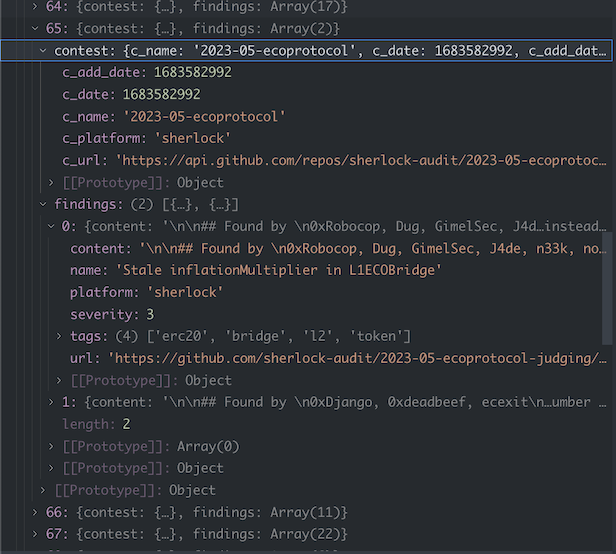

## Add to your existing esm project

- `yarn add 'findings-parser@audit-hero/findings-parser'`
  - specific commit: append `#commit={hash}'`
- add Github API access token to env

```
export GITHUB_ACCESS_TOKEN=""
```

```typescript
import { downloadC4Readme, getC4Contests, parseC4Findings, getFindings } from "findings-parser"

// replace C4 with sherlock if you want to parse sherlock findings
let findings = await getFindings(getC4Contests, downloadC4Readme, parseC4Findings)
```

## Build and test locally

- `yarn && yarn test`

### get findings for sherlock and c4

- `tsx ./src/index.run.ts`
  currently(10/23) returns 6122 c4 and 1218 sherlock findings



## Add a new findings provider

Check out ./c4 or /sherlock folder for a reference implementation. In the end, the parser should
return an array of `Finding`:

```typescript
export type Finding = {
  pk: string
  name: string
  platform: FindingSource
  severity?: Severity
  tags: Tag[]
  url?: string
  content?: string
  c_name?: string
}
```

Please make a pull request with a new parser or bugfixes to current ones.
